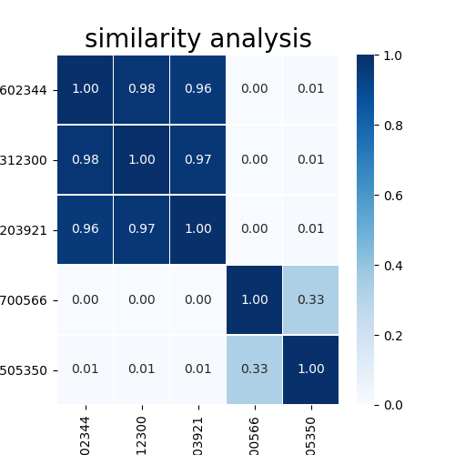

# Text-Similarity-Analysis

Text similarity Analysis by TF-IDF Algorithm.

visualization using seaborn heapmap.

### TF-IDF Algorithm

In [information retrieval](https://en.wikipedia.org/wiki/Information_retrieval), **tf–idf** or **TFIDF**, short for **term frequency–inverse document frequency**, is a numerical statistic that is intended to reflect how important a word is to a [document](https://en.wikipedia.org/wiki/Document) in a collection or [corpus](https://en.wikipedia.org/wiki/Text_corpus). It is often used as a [weighting factor](https://en.wikipedia.org/wiki/Weighting_factor) in searches of information retrieval, [text mining](https://en.wikipedia.org/wiki/Text_mining), and [user modeling](https://en.wikipedia.org/wiki/User_modeling). ([wikipedia](https://en.wikipedia.org/wiki/Tf%E2%80%93idf))

## Requirements

- Python 3.x.x
- knolpy
- [JPype](http://konlpy-ko.readthedocs.io/ko/v0.4.3/install/#id2)

## Getting Started

You need to install JPype to use the morpheme analyzer.

JPype is an effort to allow python programs full access to java class
libraries. 

## Test

I will test with several articles

```shell
pip install newspaper3k
```

1st article: http://v.media.daum.net/v/20171215130602344 (bitcoin related)

2nd article: http://v.media.daum.net/v/20171215130312300 (bitcoin related)

3rd article: http://v.media.daum.net/v/20171215111203921 (bitcoin related)

4th article: http://v.media.daum.net/v/20171216002700566 (weather related)

5th article: http://v.media.daum.net/v/20171215214505350 (weather related)

```python
from newspaper import Article

url_list = ['http://v.media.daum.net/v/20171215130602344',
            'http://v.media.daum.net/v/20171215130312300',
            'http://v.media.daum.net/v/20171215111203921',
            'http://v.media.daum.net/v/20171216002700566',
            'http://v.media.daum.net/v/20171215214505350']
for url in url_list:
    article = Article(url, langague='ko')
    article.download()
    article.parse()

    okt_nouns = ' '.join(okt.nouns(article.text))
    mydoclist_okt.append(okt_nouns)
    
tfidf_vectorizer = TfidfVectorizer(min_df = 1)
tfidf_matrix_okt = tfidf_vectorizer.fit_transform(mydoclist_okt)
document_distances_okt = (tfidf_matrix_okt * tfidf_matrix_okt.T)
print(document_distances_okt.toarray())
```

## Result

```shell
[[1.         0.98024875 0.95977812 0.         0.00650447]
 [0.98024875 1.         0.9691473  0.         0.00647298]
 [0.95977812 0.9691473  1.         0.         0.006262  ]
 [0.         0.         0.         1.         0.3313002 ]
 [0.00650447 0.00647298 0.006262   0.3313002  1.        ]]
```

visualization using seaborn heapmap.



## Reference

* [https://code-ing.tistory.com/1?category=728528](https://code-ing.tistory.com/1?category=728528)
